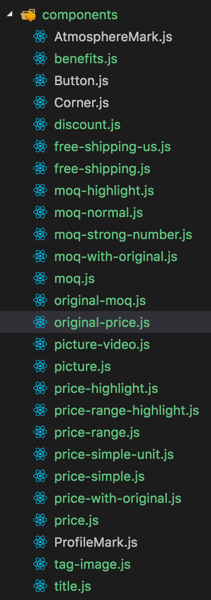

## 关于构建器

本文描述一个构建器的做法

### 需求
最开始的需求来自营销的开发，每次营销的开发其实都是开发类似的东西：List和Cell，而其中，这个Cell的元件是可以被穷举的。所以后来就考虑到，有没有可能我只开发元件，并且维护元件，后续需要的Cell就由这堆元件+配置生成相关的Cell呢。

后续的需求为：不同的元件需要的字段都是不一样的，那么，是不是可以通过这个Cell的构建器，顺带收集不同元件的字段，并且生成一个List所需要的字段表呢？

如果考虑到不同的后端对应不同的数据结构，那么把后端数据结构和List的数据接口match上的这部分代码，是不是也是可以由这个构建器去生成呢？
最后就是List的做法，目前的list有*header、footer、list中间嵌入楼层、list末尾嵌入You may like、list中间嵌入Cell*等多种形式，那这些是不是也是可以通过构建器去输出呢？

### 最开始
- 最开始当然是先完成一个可以把元件拼装成组件的工具。考量很简单，生成一个工程，工程包含：元件UI、元件字段、Base元件，合成的组件，构建出来的组件。

- 元件UI以及元件字段参考以往工作中落实下来的部分：例如**title、img、Price、moq、corner等。例如下图有这样的多种分类


- 字段参考fieldParser

- Base元件不考虑太多，暂时做一个无任何作用的BaseComponent。然后让所有组件都继承这个BaseComponent

- 合成的组件目前靠手写，后续才考虑使用描述schema+组件来配置好（可以考虑OCMS的PI的方法），如下
```jsx
import BaseCell from './Common/BaseCell';

import Title from './components/title';
import Picture from './components/picture-video';
import Price from './components/price';
import Container from './common/Container';
  
  export default class Cell extends BaseCell {
      static defaultProps = {}
    
      state = {
    
      }
    
      constructor(props) {
        super(props);
    
      }
      
      render() {
          return (
            <Container>
                <Title />
                <Picture />
                <Price />
            </Container>
          );
      }
    }
```

- 项目使用webpack，build后构建成多个组件及其*基本依赖.json*
[webpack参考](https://www.jianshu.com/p/42e11515c10f)